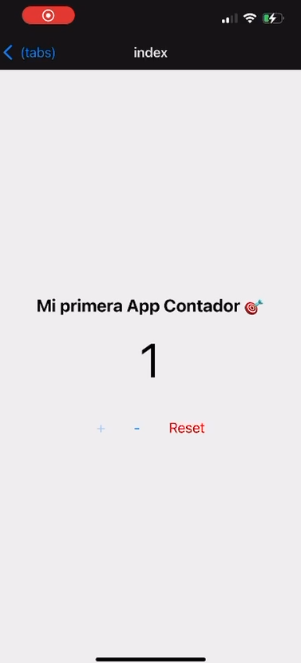

🗂️ Datos del Proyecto
Nombre del proyecto: AppContador_UT1

Autor/a: Javier González Mederos

Fecha: 14/10/2025

Versión de Expo: SDK 52

Versión de IOS 18

🧠 Tecnología Elegida y Por Qué
He elegido Expo / React Native porque permite desarrollar aplicaciones móviles para Android e iOS usando JavaScript y React, de forma sencilla y rápida.
No requiere configuraciones complejas con Android Studio y facilita la ejecución en dispositivos físicos mediante la app Expo Go.
Es ideal para principiantes en desarrollo móvil que ya dominan React en entorno web.

⚙️ Configuración del Entorno y Ejecución
1. Instalación del entorno:
Instalar Node.js (versión LTS recomendada).

Instalar Expo CLI (opcional, ya incluida con npx).

2. Creación del proyecto:
bash
npx create-expo-app AppContador_UT1
3. Entrar en la carpeta del proyecto:
bash
cd AppContador_UT1
4. Ejecución del proyecto:
bash
npx expo start
5. Probar la aplicación:
Escanear el código QR con Expo Go desde el móvil, o

Ejecutar en un emulador Android/iOS desde la interfaz de Expo.

🌐 Modo de conexión:
Usar LAN si el móvil y el ordenador están en la misma red Wi-Fi.

Si no conecta, cambiar a Tunnel en la interfaz de Expo.

📱 Perfil de Despliegue
Parámetro	Valor
Expo SDK	52
Plataforma	Android
Dispositivo o emulador usado	iphone 13 Pro
Versión del sistema	IOS 18
Modo de ejecución	Expo Go — modo [LAN / Tunnel]
🧮 Funcionamiento de la App
La app muestra un número inicial (0) y tres botones principales:

Botón "+" → Incrementa el contador.

Botón "−" → Decrementa el contador.

Botón "Reset" → Reinicia el contador a 0.

El valor del contador se actualiza en tiempo real.
Además, cuando el valor llega a 10, aparece el mensaje:
🎉 ¡Meta alcanzada!

📸 Captura de Pantalla

🧭 Conclusión y Limitaciones
Esta actividad me permitió crear mi primera aplicación móvil desde cero con Expo y React Native.
Aprendí a instalar el entorno, ejecutar el proyecto en un dispositivo físico y manejar estados con el hook useState.
También comprendí cómo funciona la estructura moderna de Expo Router con el archivo app/index.tsx en lugar del tradicional App.js.

⚠️ Limitaciones encontradas:
El emulador puede ser lento si no se configura bien la aceleración por hardware.

En algunos casos Expo no conecta por LAN y es necesario usar el modo Tunnel.

La app es básica, pero sirve como base para entender la lógica del estado y la actualización de la UI en tiempo real.

✅ Conclusión:
Fue una experiencia muy útil para afianzar los fundamentos del desarrollo móvil. Expo me pareció una herramienta intuitiva y eficiente para crear apps multiplataforma con React.